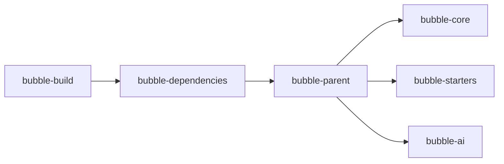

# 架构与设计

## 模块关系

## 设计原则

- 模块化单体（Spring Modulith）：聚合式管理、明晰边界、可演化为微服务
- Starter 化能力：以 AutoConfiguration/Properties 输出标准能力
- 统一响应与错误码：采用 `Result` 与 `ErrorCode` 统一风格

## 运行启动流程

- 启动事件监听：在应用启动完成后输出关键访问信息与文档入口（`bubble-starters/bubble-starter/src/main/java/cn/fxbin/bubble/lanuch/StartedEventListener.java:50`）

## 关键组件示例

- 统一响应模型：`bubble-core/src/main/java/cn/fxbin/bubble/core/dataobject/Result.java:136`
- Web 工具与性能治理：`bubble-core/src/main/java/cn/fxbin/bubble/core/util/WebUtils.java:212`
