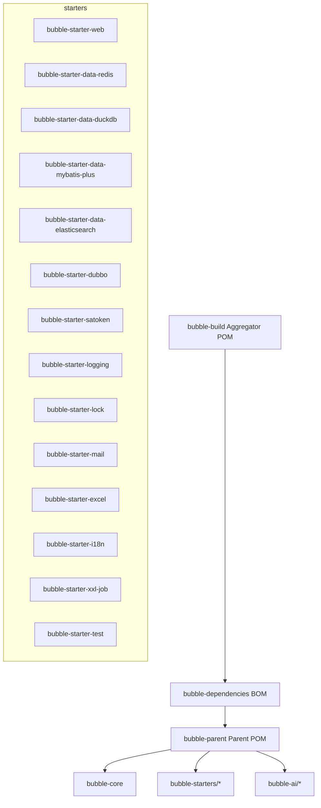

# Bubble 项目文档门户

> 当前版本：2.0.0.BUILD-SNAPSHOT｜最低 JDK：17｜许可协议：Apache-2.0

## 导航

- [项目概述](overview.md)
- [项目分析报告](analysis-report.md)
- [架构与设计](architecture.md)
- [构建系统与依赖管理](build-system.md)
- [技术栈](technology-stack.md)
- [核心库](core-framework.md)
- [Starter 模块索引](starter-modules.md)
- [AI 能力](ai.md)
- [安装指南](installation.md)
- [快速开始](quick-start.md)
- [使用说明](usage.md)
- [配置参考](configuration.md)
- [API 文档](api.md)
- [最佳实践](best-practices.md)
- [安全指南](security.md)
- [性能与优化](performance.md)
- [故障排查](troubleshooting.md)
- [文档编写规范](writing-standard.md)
- [文档自动化](documentation-automation.md)
- [版本更新记录](changelog.md)

## 项目简介

Bubble 是一个基于 Spring Boot 3.x 与 Spring Cloud 2025.x 的现代化微服务开发框架，采用 Spring Modulith 的模块化单体架构思想，提供 15+ 开箱即用 Starter，涵盖 Web、数据访问、RPC、认证授权、日志、国际化、任务调度、AI 等能力。

主要特性：

- 现代技术栈：Spring Boot 3.5.x / Spring Cloud 2025.x / Java 17+
- 模块化架构：Spring Modulith，Starter 即插即用
- 生产就绪：监控、日志、安全、治理能力完善
- 性能优化：针对高并发场景深度优化，并提供原生镜像支持
- AI 集成：Spring AI 与 LightRAG 集成

## 模块结构（示意）

## 快速入口

- 查看安装指南：`installation.md`
- 直接开始：`quick-start.md`
- 常见场景食谱：`usage.md`
- 配置与参考：`configuration.md`
