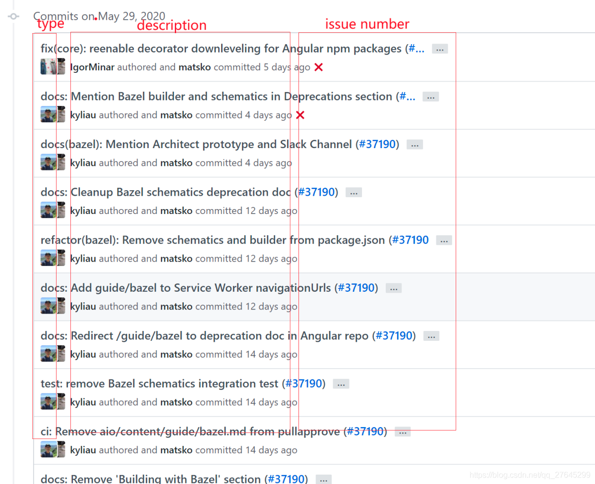

## 依赖关系

`bubble-dependencies`  依赖版本管理，作为  `bubble-parent` 的父项目，
`bubble-parent` 作为其它项目的父级项目
`bubble-core` 作为核心依赖，定义通用性质的内容，其它模块皆可依赖该模块

PS: 该依赖关系参照 [spring-boot](https://github.com/spring-projects/spring-boot)

## 包名

* `cn.fxbin.bubble.fireworks` 作为基线
  * `data`  数据操作相关，ex: mongo, redis, mysql, elasticsearch  等
  * `plugin`  其它功能性插件

## 代码提交
提交规范：type:description #issue number
* type : 提交类别，从下面的类别中进行选择，必填
* description： 提交描述，对本次提交的简短描述, 必填
* 
* build: 影响构建系统或外部依赖关系的更改（示例范围：gulp，broccoli，npm）
* ci: 更改我们的持续集成文件和脚本（示例范围：Travis，Circle，BrowserStack，SauceLabs）
* docs: 仅文档更改
* feat: 一个新功能
* fix: 修复错误
* perf: 改进性能的代码更改
* refactor: 代码更改，既不修复错误也不添加功能
* style: 不影响代码含义的变化（空白，格式化，缺少分号等）
* test: 添加缺失测试或更正现有测试

    